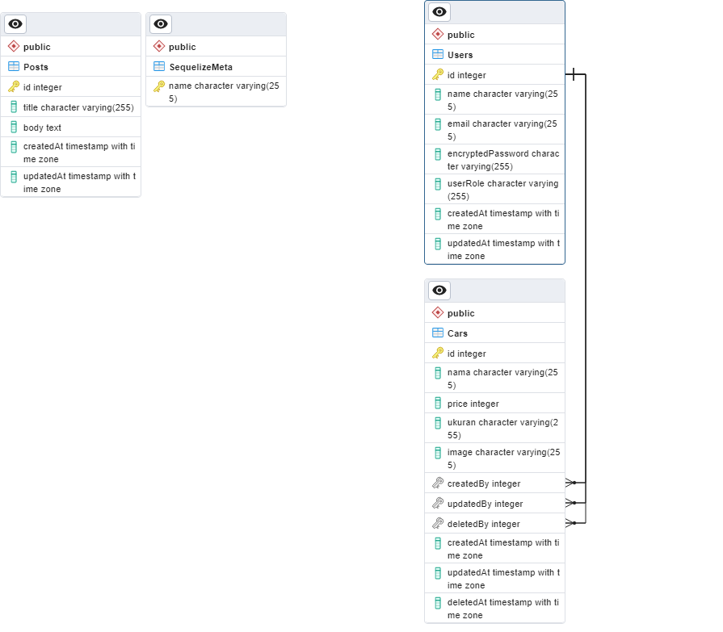

# Binar: Express.js

Haii All, 
di repository ini berisi sebuah HTTP server dengan menggunakan Express.js. Repository ini menggunakan Service Repository Pattern, yang artinya di dalam repository ini terdapat modul model, controller, service, dan repository.

## Getting Started

Untuk menjalankan development server, kalian tinggal jalanin salah satu script di package.json, yang namanya `develop`.

```sh
npm run develop
```

## Database Management

Di dalam repository ini sudah terdapat beberapa script yang dapat digunakan dalam memanage database, yaitu:

- `yarn db:create` digunakan untuk membuat database
- `yarn db:drop` digunakan untuk menghapus database
- `yarn db:migrate` digunakan untuk menjalankan database migration
- `yarn db:seed` digunakan untuk melakukan seeding
- `yarn db:rollback` digunakan untuk membatalkan migrasi terakhir

## Route Management

Di dalam repository ini terdapat beberapa routes yang dapat digunakan yaitu:
### ROUTES FOR CARS
- `GET /api/v1/cars` digunakan untuk melihat list cars 
- `POST /api/v1/cars` digunakan untuk menambahkan car
- `PUT /api/v1/cars/:id` digunakan untuk melakukan update data car
- `GET /api/v1/cars/:id` digunakan untuk melihat data car berdasarkan id
- `DELETE /api/v1/cars/:id` digunakan untuk menghapus data car
### ROUTES FOR USER
- `POST /api/v1/users` digunakan untuk menambahkan user dengan role member
- `POST /api/v1/register` digunakan untuk menambahkan user dengan role member
- `POST /api/v1/login` digunakan untuk melakukan login
- `POST /api/v1/admin/register` digunakan untuk menambahkan user dengan role superadmin dan admin

## Rules of Login
Ada 3 role yang ada dan memiliki kebijakan yang berbeda yaitu
1. Member : Hanya dapat melihat cars yang tersedia
2. Admin : dapat melakukan CRUD pada data cars
3. Superadmin : dapat melakukan CRUD pada data cars dan melakukan penambahan user dengan role admin

## SUPER ADMIN
Hanya terdapat 1 superadmin yaitu :
- Nama     : Admin Shelvi
- Email    : adminshelvi@gmail.com
- Password : superadmin

## ERD 
Dalam kasus ini menggunakan database `db_beauth_development` yang memiliki 2 tabel yaitu `Users` dan `Cars`.
Untuk gambaran dari ERD dapat dilihat pada gambar dibawah ini
